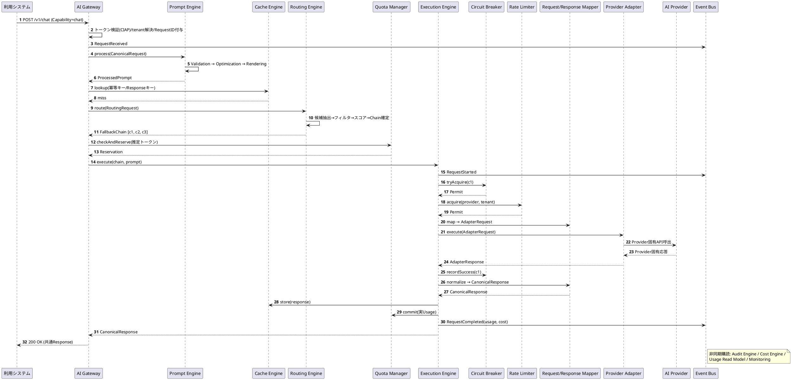
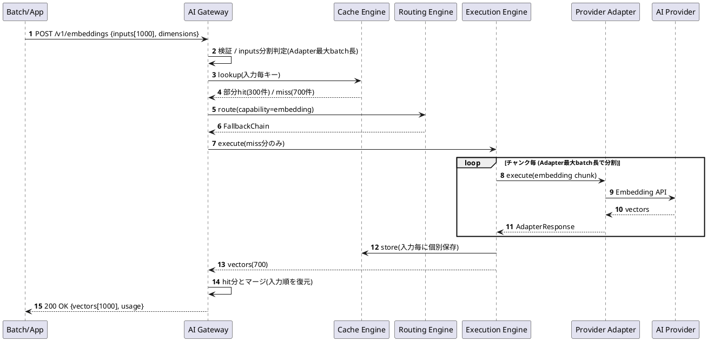
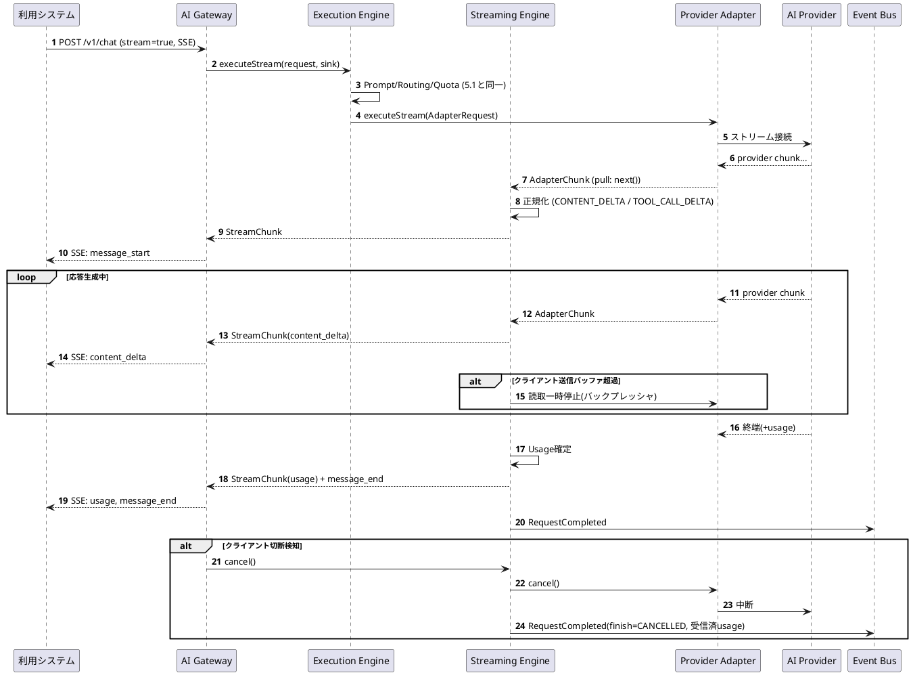
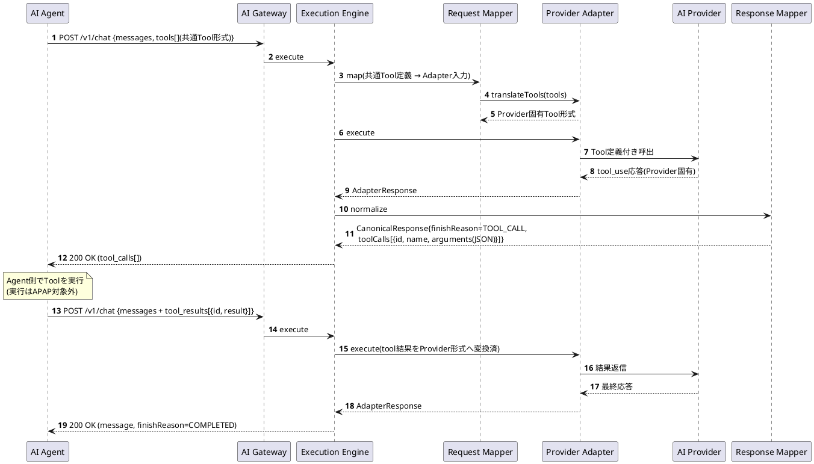
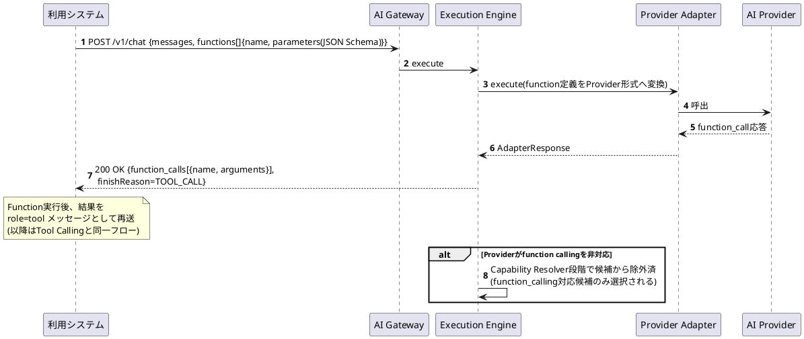
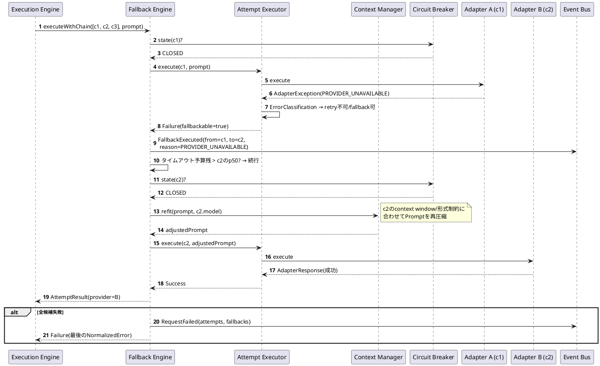
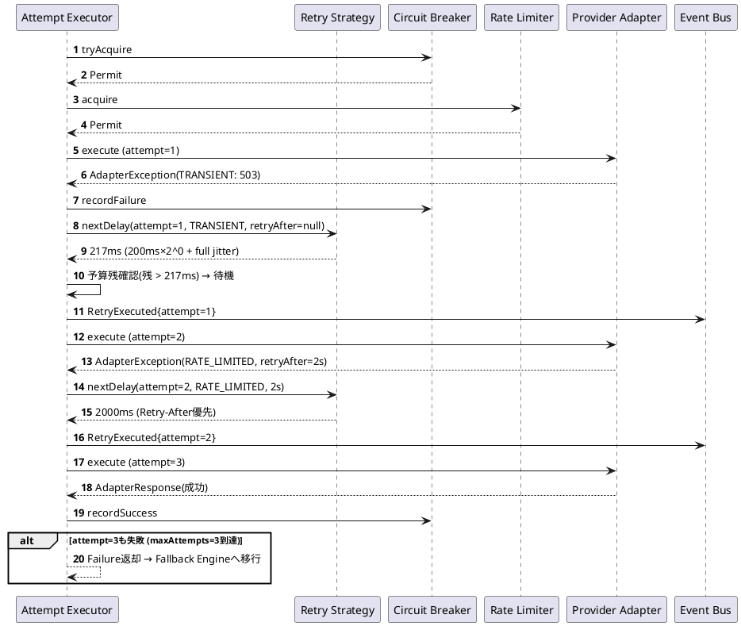
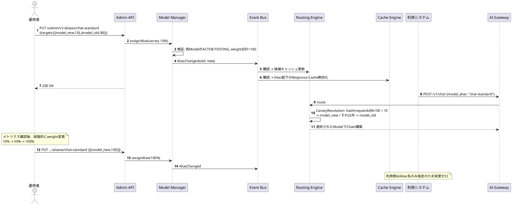
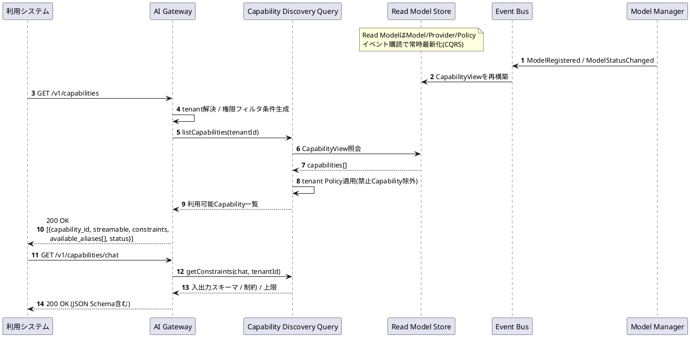
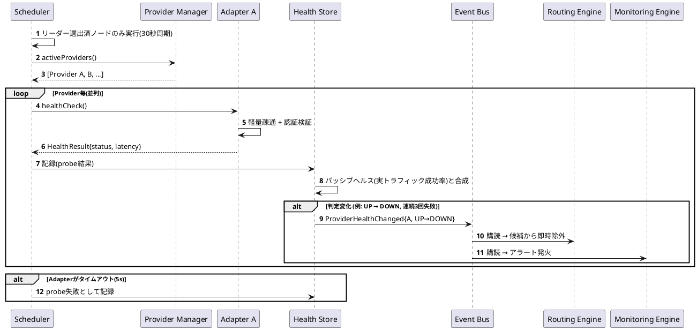

# 5. シーケンス設計

AI Provider Abstraction Platform（APAP）設計書 第5章（PlantUML）

---

## 5.1 Chat（同期）

## 5.2 Embedding

## 5.3 Streaming

## 5.4 Tool Calling

## 5.5 Function Calling

## 5.6 Fallback

## 5.7 Retry

## 5.8 Provider切替（Alias切替によるModel/Provider移行）

## 5.9 Capability Discovery

## 5.10 Health Check

