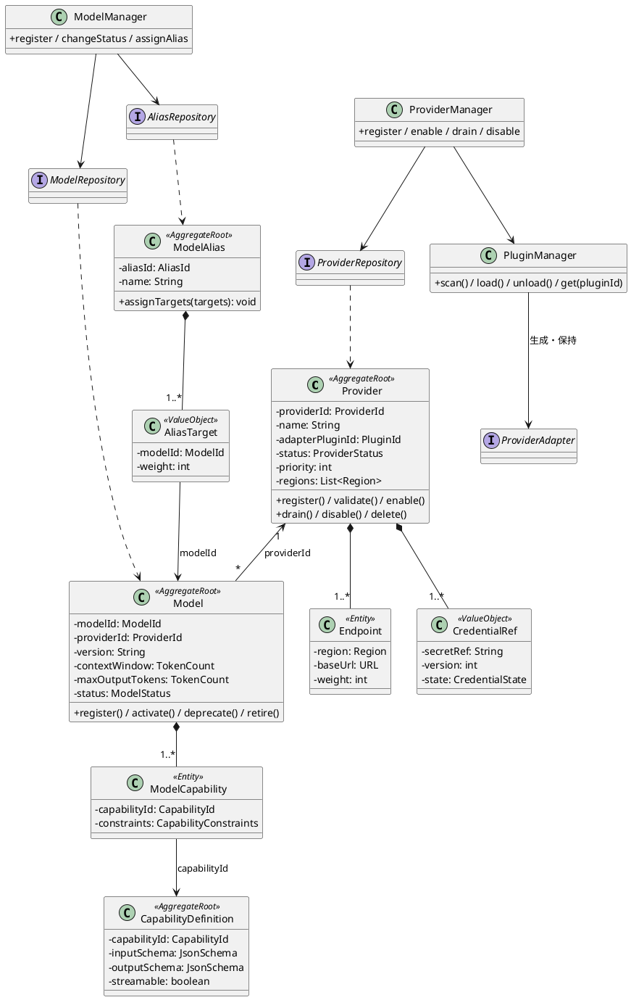
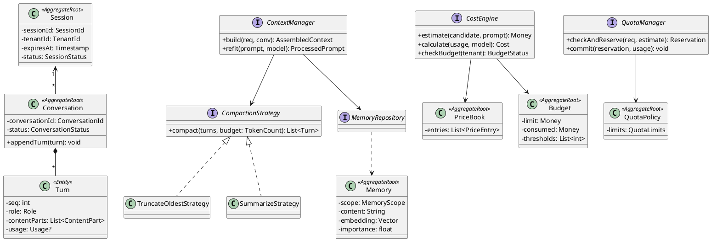

# 6. クラス図

AI Provider Abstraction Platform（APAP）設計書 第6章（PlantUML）

---

## 6.1 コア実行系クラス図

```plantuml
@startuml class_core
skinparam classAttributeIconSize 0

interface ExecutionEngine {
  +execute(req: CanonicalRequest): CanonicalResponse
  +executeStream(req: CanonicalRequest, sink: ChunkSink): void
}
class DefaultExecutionEngine
ExecutionEngine <|.. DefaultExecutionEngine

interface PromptEngine {
  +process(req: CanonicalRequest): ProcessedPrompt
}
interface PromptStage {
  +apply(draft: PromptDraft, ctx: ExecutionContext): PromptDraft
}
class PromptPipeline
PromptEngine <|.. PromptPipeline
PromptPipeline o-- "1..*" PromptStage
class ValidationStage
class OptimizationStage
class RenderingStage
PromptStage <|.. ValidationStage
PromptStage <|.. OptimizationStage
PromptStage <|.. RenderingStage

interface RoutingEngine {
  +route(req: RoutingRequest): FallbackChain
}
interface RoutingStrategy {
  +score(c: Candidate, ctx: RoutingContext): Score
}
interface RoutingPolicyEvaluator {
  +evaluate(cands: List<Candidate>, ctx): FilteredCandidates
}
interface LoadBalancer {
  +choose(top: List<ScoredCandidate>): ScoredCandidate
}
class DefaultRoutingEngine
class WeightedScoreRoutingStrategy
class WeightedRoundRobinLoadBalancer
RoutingEngine <|.. DefaultRoutingEngine
RoutingStrategy <|.. WeightedScoreRoutingStrategy
LoadBalancer <|.. WeightedRoundRobinLoadBalancer
DefaultRoutingEngine --> RoutingStrategy
DefaultRoutingEngine --> RoutingPolicyEvaluator
DefaultRoutingEngine --> LoadBalancer
DefaultRoutingEngine --> CapabilityResolver

interface CapabilityResolver {
  +resolve(capId, alias?): List<Candidate>
}

class FallbackEngine {
  +executeWithChain(chain, prompt, req): AttemptResult
}
class AttemptExecutor {
  +execute(candidate, prompt, req): AttemptResult
}
interface RetryStrategy {
  +nextDelay(attempt, error, retryAfter?): Duration?
}
class ExponentialBackoffJitterStrategy
RetryStrategy <|.. ExponentialBackoffJitterStrategy

interface CircuitBreaker {
  +tryAcquire(key: CbKey): Permit
  +recordSuccess(key: CbKey): void
  +recordFailure(key: CbKey, e: NormalizedError): void
  +state(key: CbKey): CbState
}
interface RateLimiter {
  +acquire(scope, cost): Permit
}
interface CacheEngine {
  +lookup(req, prompt): CanonicalResponse?
  +store(req, prompt, resp): void
  +invalidateByAlias(aliasId): void
}
interface RequestMapper {
  +map(prompt, candidate, req): AdapterRequest
}
interface ResponseMapper {
  +normalize(r: AdapterResponse): CanonicalResponse
  +normalizeChunk(c: AdapterChunk): StreamChunk
  +normalizeError(e: AdapterException): NormalizedError
}

DefaultExecutionEngine --> PromptEngine
DefaultExecutionEngine --> CacheEngine
DefaultExecutionEngine --> RoutingEngine
DefaultExecutionEngine --> FallbackEngine
DefaultExecutionEngine --> ResponseMapper
FallbackEngine --> AttemptExecutor
FallbackEngine --> CircuitBreaker
AttemptExecutor --> RetryStrategy
AttemptExecutor --> CircuitBreaker
AttemptExecutor --> RateLimiter
AttemptExecutor --> RequestMapper
AttemptExecutor --> ProviderAdapter

interface ProviderAdapter {
  +initialize(config, secrets): void
  +supportedCapabilities(): Set<CapabilityId>
  +execute(req: AdapterRequest): AdapterResponse
  +executeStream(req: AdapterRequest): AdapterStream
  +discoverModels(): List<DiscoveredModel>
  +healthCheck(): HealthResult
}
@enduml
```

## 6.2 Provider / Model 管理クラス図

```plantuml
@startuml class_provider_model
skinparam classAttributeIconSize 0

class Provider <<AggregateRoot>> {
  -providerId: ProviderId
  -name: String
  -adapterPluginId: PluginId
  -status: ProviderStatus
  -priority: int
  -regions: List<Region>
  +register() / validate() / enable()
  +drain() / disable() / delete()
}
class Endpoint <<Entity>> {
  -region: Region
  -baseUrl: URL
  -weight: int
}
class CredentialRef <<ValueObject>> {
  -secretRef: String
  -version: int
  -state: CredentialState
}
Provider *-- "1..*" Endpoint
Provider *-- "1..*" CredentialRef

class Model <<AggregateRoot>> {
  -modelId: ModelId
  -providerId: ProviderId
  -version: String
  -contextWindow: TokenCount
  -maxOutputTokens: TokenCount
  -status: ModelStatus
  +register() / activate() / deprecate() / retire()
}
class ModelCapability <<Entity>> {
  -capabilityId: CapabilityId
  -constraints: CapabilityConstraints
}
Model *-- "1..*" ModelCapability
Provider "1" <-- "*" Model : providerId

class ModelAlias <<AggregateRoot>> {
  -aliasId: AliasId
  -name: String
  +assignTargets(targets): void
}
class AliasTarget <<ValueObject>> {
  -modelId: ModelId
  -weight: int
}
ModelAlias *-- "1..*" AliasTarget
AliasTarget --> Model : modelId

class CapabilityDefinition <<AggregateRoot>> {
  -capabilityId: CapabilityId
  -inputSchema: JsonSchema
  -outputSchema: JsonSchema
  -streamable: boolean
}
ModelCapability --> CapabilityDefinition : capabilityId

interface ProviderRepository
interface ModelRepository
interface AliasRepository
ProviderRepository ..> Provider
ModelRepository ..> Model
AliasRepository ..> ModelAlias

class ProviderManager {
  +register / enable / drain / disable
}
class ModelManager {
  +register / changeStatus / assignAlias
}
class PluginManager {
  +scan() / load() / unload() / get(pluginId)
}
ProviderManager --> ProviderRepository
ProviderManager --> PluginManager
ModelManager --> ModelRepository
ModelManager --> AliasRepository
PluginManager --> ProviderAdapter : 生成・保持
interface ProviderAdapter
@enduml
```

## 6.3 Context / Conversation / Cost クラス図

```plantuml
@startuml class_context_cost
skinparam classAttributeIconSize 0

class Session <<AggregateRoot>> {
  -sessionId: SessionId
  -tenantId: TenantId
  -expiresAt: Timestamp
  -status: SessionStatus
}
class Conversation <<AggregateRoot>> {
  -conversationId: ConversationId
  -status: ConversationStatus
  +appendTurn(turn): void
}
class Turn <<Entity>> {
  -seq: int
  -role: Role
  -contentParts: List<ContentPart>
  -usage: Usage?
}
Session "1" <-- "*" Conversation
Conversation *-- "*" Turn

class Memory <<AggregateRoot>> {
  -scope: MemoryScope
  -content: String
  -embedding: Vector
  -importance: float
}

interface ContextManager {
  +build(req, conv): AssembledContext
  +refit(prompt, model): ProcessedPrompt
}
interface CompactionStrategy {
  +compact(turns, budget: TokenCount): List<Turn>
}
class TruncateOldestStrategy
class SummarizeStrategy
CompactionStrategy <|.. TruncateOldestStrategy
CompactionStrategy <|.. SummarizeStrategy
ContextManager --> CompactionStrategy
ContextManager --> MemoryRepository
interface MemoryRepository
MemoryRepository ..> Memory

class PriceBook <<AggregateRoot>> {
  -entries: List<PriceEntry>
}
class Budget <<AggregateRoot>> {
  -limit: Money
  -consumed: Money
  -thresholds: List<int>
}
class QuotaPolicy <<AggregateRoot>> {
  -limits: QuotaLimits
}
interface CostEngine {
  +estimate(candidate, prompt): Money
  +calculate(usage, model): Cost
  +checkBudget(tenant): BudgetStatus
}
interface QuotaManager {
  +checkAndReserve(req, estimate): Reservation
  +commit(reservation, usage): void
}
CostEngine --> PriceBook
CostEngine --> Budget
QuotaManager --> QuotaPolicy
@enduml
```
