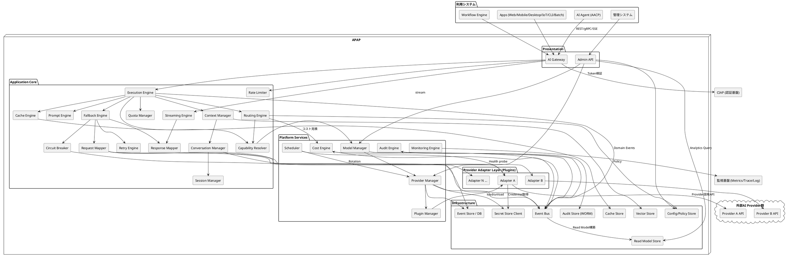

# 7. コンポーネント図

AI Provider Abstraction Platform（APAP）設計書 第7章（PlantUML）

---

**補足**:

| 接続 | プロトコル/契約 |
|---|---|
| 利用システム → AI Gateway | REST(OpenAPI) / gRPC(Protobuf) / SSE。SDKは定義から生成 |
| Gateway → CIAP | OIDC/JWT検証（JWKSキャッシュ、ACL経由） |
| Core → Adapter | `ProviderAdapter` SPI（プロセス内Plugin。隔離要件が高い場合はサイドカープロセス + gRPC化可能。SPI契約は同一） |
| Adapter → Provider | Provider固有（Adapter内に閉じる） |
| Core → Event Bus | at-least-once、Aggregate単位順序保証 |
| Audit Store | 追記専用（WORM） |
