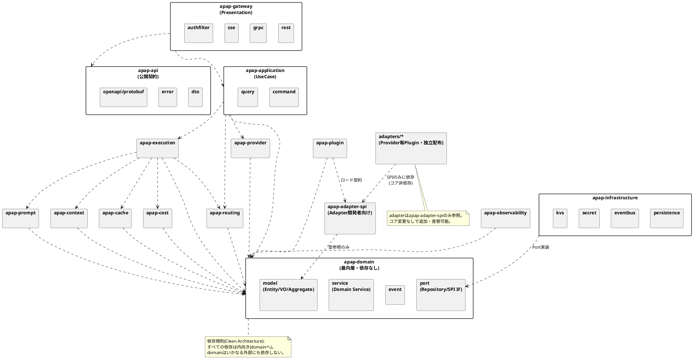

# 8. パッケージ図

AI Provider Abstraction Platform（APAP）設計書 第8章（PlantUML）

---

**依存規則の要点**: `apap-domain` は依存ゼロの最内層。`adapters/*` は `apap-adapter-spi` のみに依存し、独立してビルド・配布・バージョニングされる（NFR-EXT-001 / NFR-MNT-001）。`apap-infrastructure` はDomainのPort（interface）を実装する側であり、依存性逆転が成立する。
