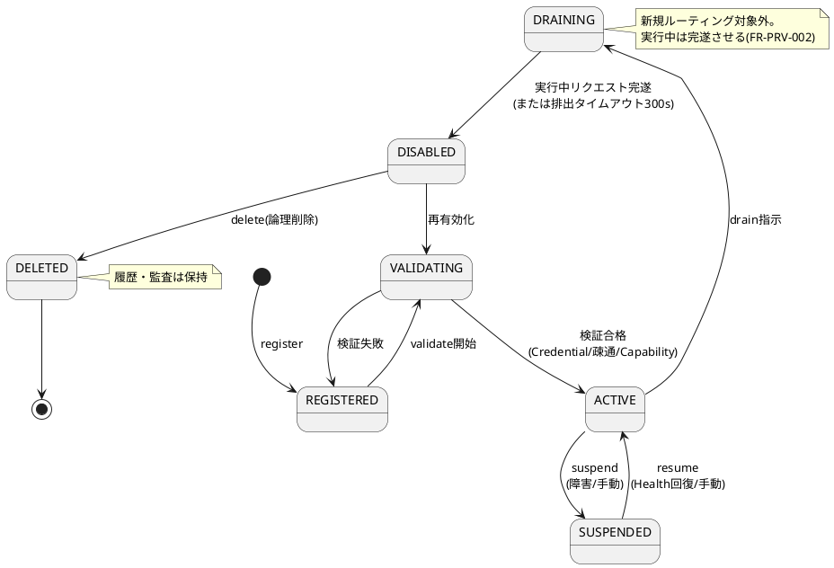
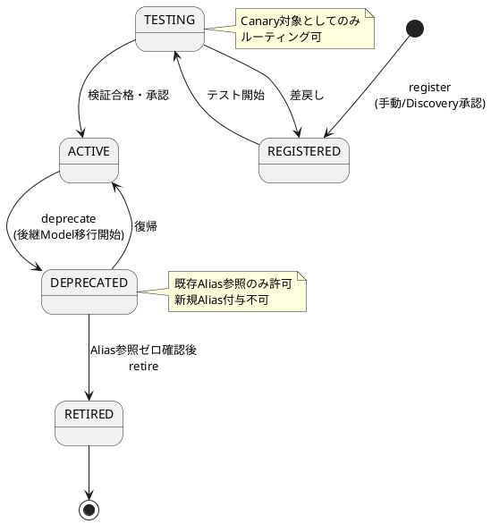
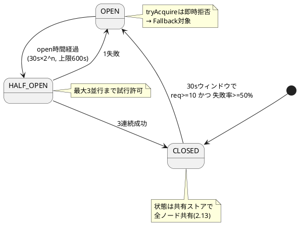
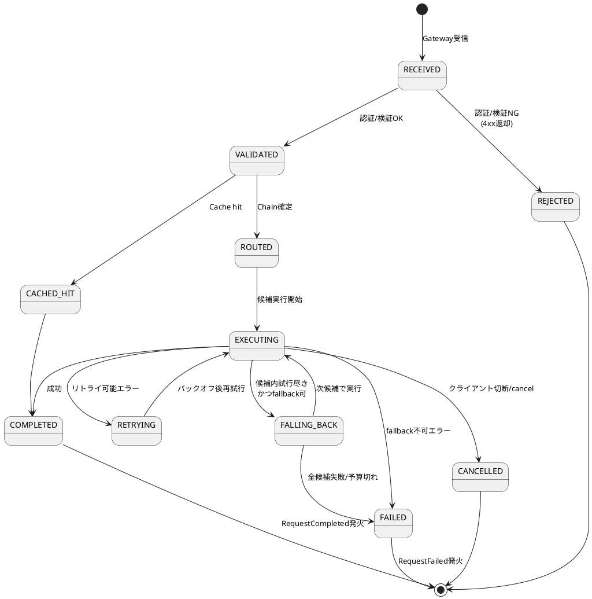
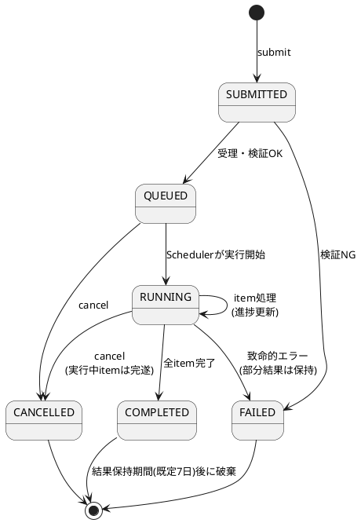
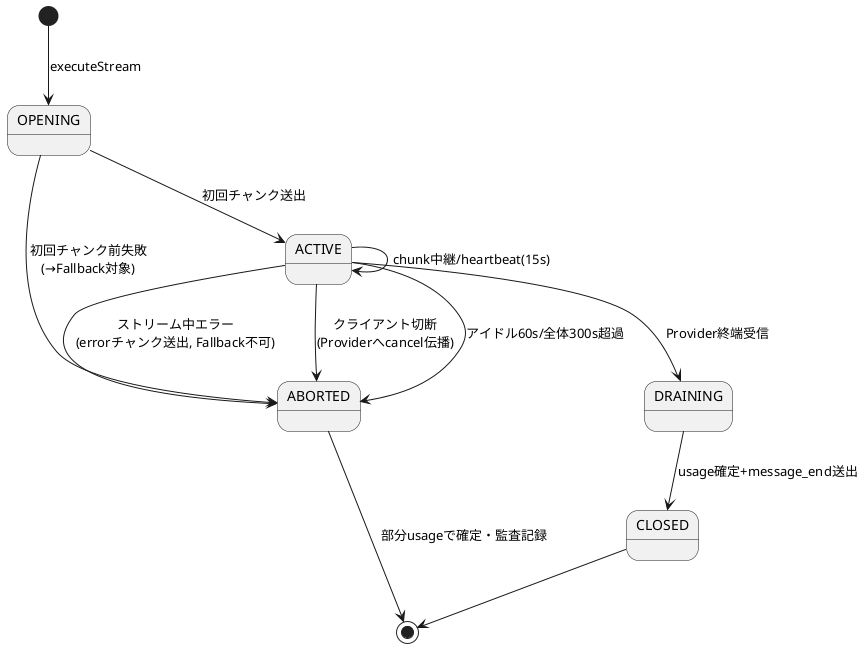
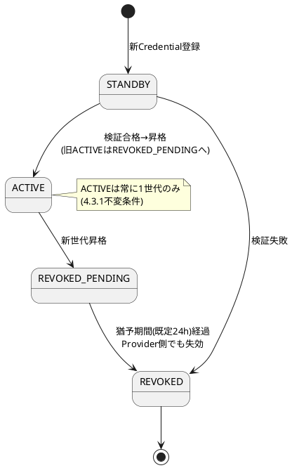

# 9. 状態遷移図

AI Provider Abstraction Platform（APAP）設計書 第9章（PlantUML）

---

## 9.1 Provider状態遷移

## 9.2 Model状態遷移

## 9.3 Circuit Breaker状態遷移

## 9.4 リクエストライフサイクル

## 9.5 Batch Job状態遷移

## 9.6 Streamセッション状態遷移

## 9.7 Credential状態遷移

