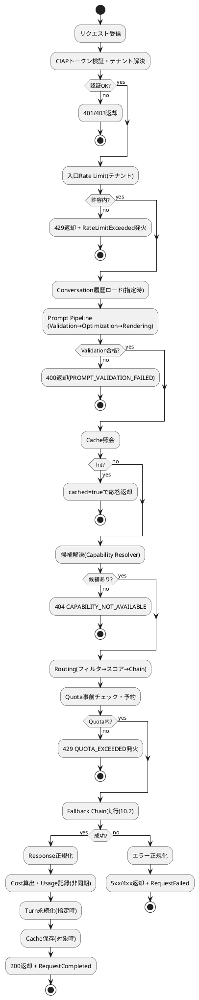
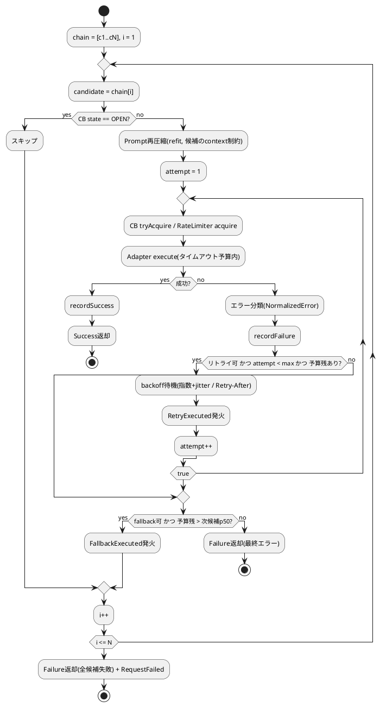
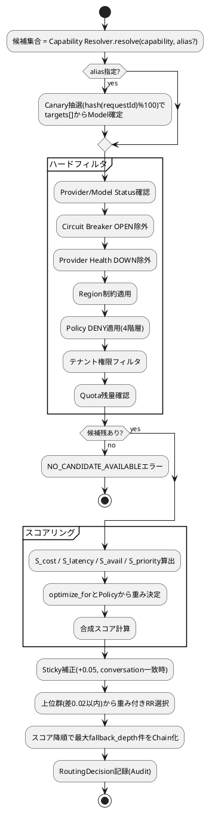
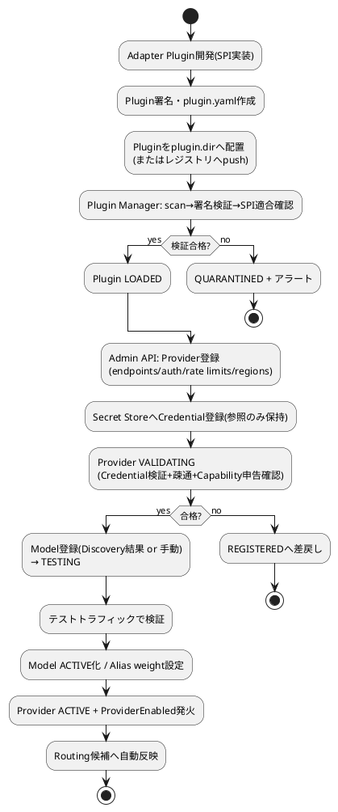
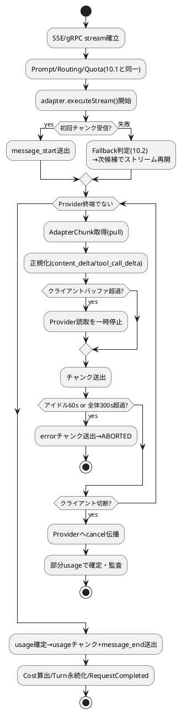

# 10. アクティビティ図

AI Provider Abstraction Platform（APAP）設計書 第10章（PlantUML）

---

## 10.1 リクエスト実行全体フロー

## 10.2 Fallback Chain実行（Retry内包）

## 10.3 Routing決定フロー

## 10.4 Provider追加フロー（運用）

## 10.5 Streaming処理フロー

