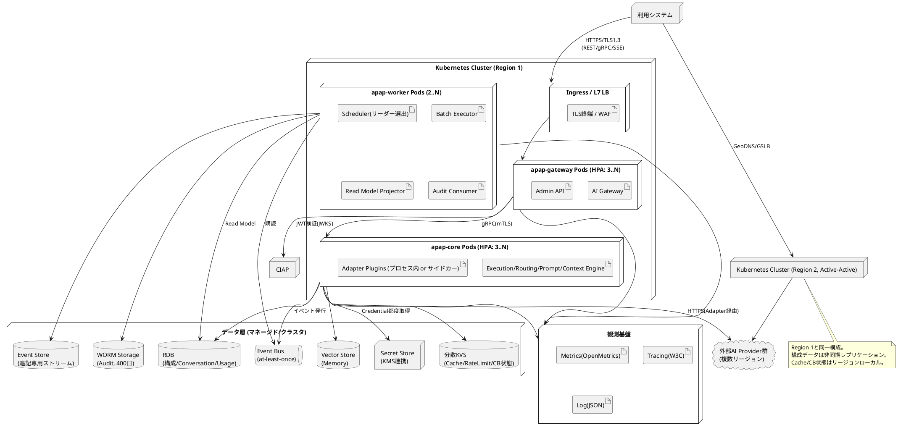

# 11. デプロイメント図

AI Provider Abstraction Platform（APAP）設計書 第11章（PlantUML）

---

**配置方針**:

| 項目 | 方針 |
|---|---|
| ステートレス性 | gateway / core Podは状態を持たない（NFR-AVL-003）。状態は全てデータ層へ |
| スケール | HPA。gateway: CPU+接続数、core: CPU+キュー長、worker: ラグ |
| Plugin配置 | 既定はcore Podプロセス内ロード。隔離要求が高いAdapterはサイドカーコンテナ（同一SPI、gRPCブリッジ） |
| Scheduler | workerでリーダー選出（単一実行保証） |
| マルチリージョン | Active-Active。構成系（Provider/Model/Policy）はRegion 1をソースに非同期複製。実行系状態（Cache/CB/RateLimit）はリージョンローカル |
| ゼロダウンタイム | ローリングアップデート + DRAINING（PreStopでin-flight完遂、Streaming最大300s猶予） |
| ネットワーク | 外部TLS1.3、内部mTLS、Adapter→Providerはegress制御（Provider毎に許可先を限定 = Provider Isolation） |
