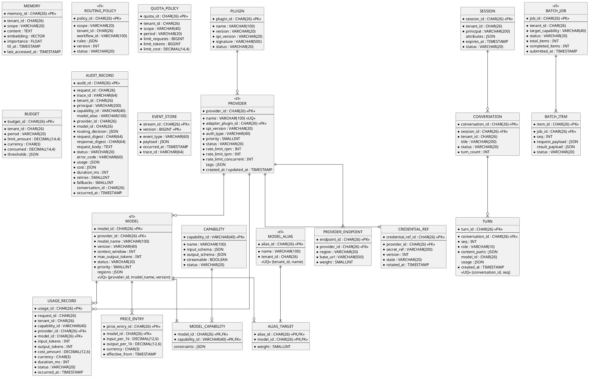

# 12. ER図

AI Provider Abstraction Platform（APAP）設計書 第12章（PlantUML）

ID列はULID（26文字）。`(ES)` 印のAggregateはEvent Store併用（本テーブルは最新状態のスナップショット/Read Model）。

---

**設計注記**: AUDIT_RECORDは追記専用（UPDATE/DELETE権限を付与しない）。`request_body` は監査ポリシーopt-in時のみ格納（マスキング済）。USAGE_RECORDは集計Read Model（Cost/Analytics Query用）の元データで、時系列パーティション（月次）。EVENT_STOREは `(stream_id, version)` の楽観ロックで追記整合を担保。
